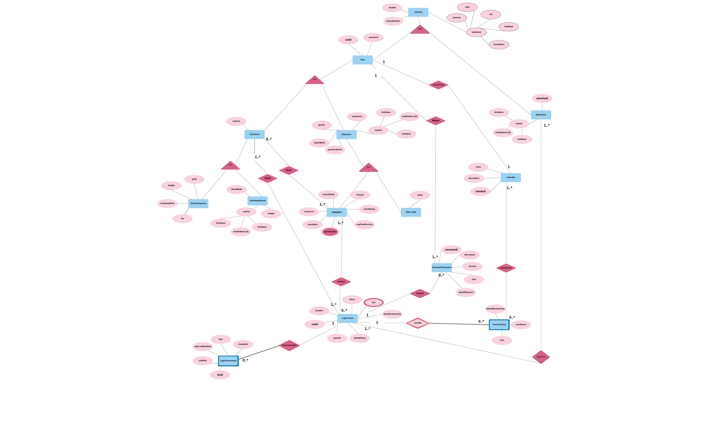
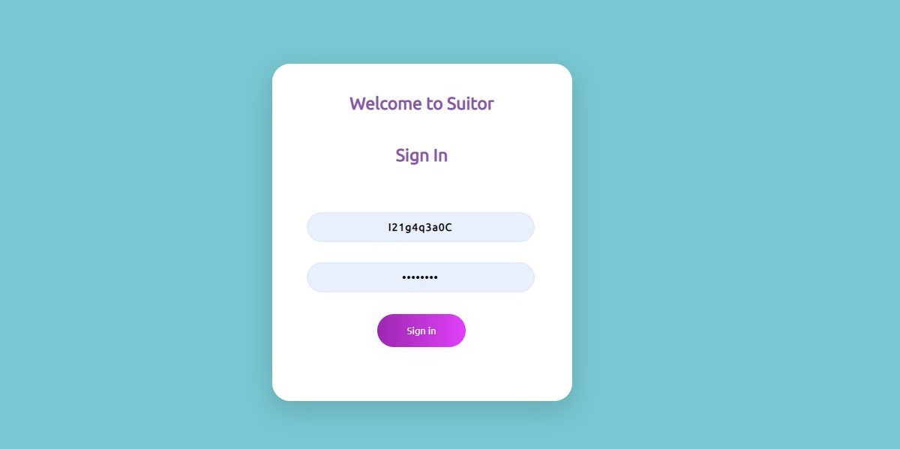
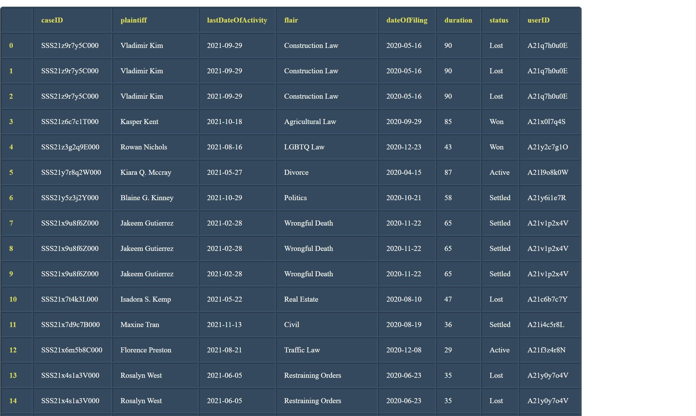

## **LAW FIRM DATABASE MANAGEMENT**

## →**Aditi Sejal (2019228)**

## → **Neha Goel (2019066)**

## → **Shivam Verma (2019272)**

## → **Kushagra Gupta (2019056)**

## → **Karish Grover (2019471)**

**Brief Overview:**

The application manages data of various aspects of the firm, like details of lawyers, their ongoing cases, employee earnings, partner earnings, firm earnings, firm expenditure etc. The Managing Partner of the firm lies at the topmost position in the hierarchy of stakeholders and has access to all the information in the database. All the other stakeholders i.e. Firm Partners, Employees (Associates, Paralegals, Secretaries, Office management, IT, HR, Finance and Accounting, Support staff etc.), Clients, Bar Council etc. have various levels of authorization and their views are tailored accordingly.

**Problem statement**

**------------------------------------------------------------------**

- Finding the best suited lawyer on the basis of track record, time taken to solve cases, fee etc.
- Helping young associates find their career forte on the basis of track record while working on cases in various legal fields.

**Relationships**

**------------------------------------------------------------------**

- customer **isA** User
- contact **isA** User
- An Individualclient **isA** customer
- A CompanyClient **isA** customer if there is a corporate
- Employee **isA** User
- An lawyer **isA** employee
- All other staff **isA** Employee
- Employee **receive** financial transaction
- Customer **hasA** legal cases
- Customer **owes** financial transaction to be paid as a fee or charge
- Customer **hires** lawyers
- Lawyer **handles** legal cases
- Legal Cases are **documented by** Legal Documents
- Legal cases demand **invest** ment of finances
- Hearing of legal cases is **held On** hearing Date
- User **keeps tracks** of schedule using calendar
- Court Hearing are **displayedIn** Calendar

## - **ER-DIAGRAM**

## - **SCHEMA**

## - **DATABASE TABLES**

**Schema**

**--------------------------------------------------------------------------**

- **lawyer** (userID : char(10), emailID : varchar(256), phoneNumber : char(10), address**(**streetName : varchar(256), pincode: varchar(10), buildingNumber : int, city : varchar(50), state : varchar(50)**)**, name(firstName : varchar(30), middleName : varchar(30), lastName : varchar(30)), dateOfBirth : date, experience : mediumint , gender : varchar(30), casesLost : int, casesSettled : mediumint, casesWon : mediumint, avgTimePerCase : mediumint, {specialization} : varchar(256), charges : mediumint, positionAtFirm : varchar(100), clientRating : mediumint, _calendarID_ : char(10)).

- **otherStaff** (userID: char(10), emailID : varchar(256), phoneNumber:char(10), address(streetName : varchar(256), pincode : varchar(10), buildingNumber : int, city : varchar(50), state : varchar(50)), name(firstName : varchar(30), middleName : varchar(30), lastName : varchar(30)), dateOfBirth : date, experience : mediumint, gender : varchar(30), positionAtFirm : varchar(100), salary : mediumint, _calendarID_ : char(10)).

- **opposition** (oppositionID : char(10), emailID : varchar(256), phoneNumber: char(10), name(firstName : varchar(30), middleName : varchar(30), lastName : varchar(30)), address(streetName : varchar(50), pincode : varchar(10), buildingNumber : int, city : varchar(50), state : varchar(50))

- **legalCases** (caseID: char(15), dateOfFiling : date, dateOfLastActivity : date, status : varchar(256), duration : mediumint ,{flair} : varchar(256), plaintiff : varchar(256)).

- **courtHearing** (caseID : char(10), time: time, courtRoom : varchar(256), nextHearingDate : date).

- **financialTransaction** (transactionID : char(10), amount : mediumint, description : varchar(256), type : tinyint, dateOfPayment : date)

- **legalDocument** (docID : char(10), createdOn : date, type : varchar(256) , visibility : tinyint, dateLastModified : date, _caseID_ : char(15)).

- **calendar** (calendarID : char(10), deadline: varchar(256), description : varchar(256))

- **clientCompanies** (userID : char(10), isClient: tinyint, emailID : varchar(256), phoneNumber : char(10), address(streetName : varchar(256), pincode : varchar(10), buildingNumber : int, city : varchar(50), state : varchar(50)),name(firstName : varchar(30), middleName : varchar(30), lastName : varchar(30)), budget : mediumint, companyName : varchar(256), gstIN, fax : varchar(100), _calendarID_).

- **individualClients** (userID : char(10), isClient: tinyint, emailID : varchar(256), phoneNumber : char(10), address(streetName : varchar(256), pincode : varchar(10), buildingNumber : int, city : varchar(50), state : varchar(50)),name(firstName : varchar(30), middleName : varchar(30), lastName : varchar(30)), budget : mediumint, dateofBirth : date, _calendarID_ : char(256)).

- **handles** (caseID : char(15), userID : char(10))

- **hasA** (userID : char(10), caseID : char(15))

- **displayedIn** (calendarID : char(10), caseID : char(15),time: time)

- **oweUs** (transactionID: char(10), userID: char(10))

- **receive** (transactionID:char(10) , userID: char(10))

- **user** (userID:char(10) , password: char(8))

- **hire** (userID : char(10), lawyerID : char(10))

- **against** (oppositionID : char(10), caseID : char(15))

- **makes** (transactionID:char(10), userID:char(10))

- **Invest** (caseID : char(15), transactionID : char(10))

**Lawyer**

**-------------------------------------------------------------------------------**

| Variable | Datatype | Integrity Constraints |
| --- | --- | --- |
| userID | char(10) | Primary Key, Not null |
| firstName | varchar(30) | Not null except middleName which is optional, composite attribute (name) |
| middleName | varchar(30) |
| lastName | varchar(30) |
| dateOfBirth | date | Not null |
| gender | varchar(30) | Not null |
| charges | mediumint | Not null, check \&gt;= 2000 and \&lt;= 20000 |
| casesWon | mediumint | Not null |
| casesLost | mediumint | Not null |
| casesSettled | mediumint | Not null |
| experience | mediumint | Not null |
| emailID | varchar(256) | Not null |
| phoneNumber | char(10) | Not null |
| positionAtFirm | varchar(100) | Not null, check in Associate, Lawyer, Paralegal, Partner |
| avgTimePerCase | mediumint |
| buildingNumber | int | Not null, composite attribute (address) |
| pincode | int |
| streetName | varchar(256) |
| city | varchar(50) |
| state | varchar(50) |
| specialization | varchar(256) | Not null, part of Primary Key |
| clientRating | mediumint | Not null, check between 0 and 10 |
| _calendarID_ | char(10) | Not null, Foreign Key referenced by Calendar |

**LegalCases** 

**-------------------------------------------------------------------------------------**

| Variable | Datatype | Integrity Constraints |
| --- | --- | --- |
| caseID | char(15) | Primary Key, Not null |
| status (Active/Settled/Won/Lost) | varchar(256) | Not null, (&quot;active&quot;,&quot;lost&quot;,&quot;won&quot;, &quot;settled&quot;) |
| plaintiff | varchar(256) | Not null |
| dateOfFiling | date | Not null |
| lastDateOfActivity | date | Not null |
| duration | mediumint | Not null |
| flair | varchar(256) | Not null |

**LegalDocuments**

**--------------------------------------------------------------------------**

| **Variable** | **Datatype** | **Integrity Constraints** |
| --- | --- | --- |
| docID | char(10) | Primary Key |
| createdOn | date | Not Null |
| caseID | char(15) | Foreign Key referenced by LegalCases, part of Primary Key along with docID, Not Null |
| dateLastModified | date | Not null |
| visibility | tinyint | Not Null, check 0 or 1 |
| type | varchar(256) | Not Null |

**ClientCompanies**

**--------------------------------------------------------------------------**

| **Variable** | **Datatype** | **Integrity Constraints** |
| --- | --- | --- |
| userID | char(10)) | Primary Key |
| isClient | tinyint | Not null |
| firstName | varchar(30) | Not null except middleName which is optional, composite attribute (name) |
| middleName | varchar(30) |
| lastName | varchar(30) |
| phoneNumber | char(10) | Not null |
| emailID | varchar(256) | Not null |
| fax | varchar(100) |
| buildingNumber | int | Not null, composite attribute (address) |
| pincode | varchar(10) |
| streetName | varchar(256) |
| city | varchar(50) |
| state | varchar(50) |
| budget | mediumint | Not null |
| companyName | varchar(256) | Not null |
| gstIN | varchar(11) |
| calendarID | char(10) | Foreign Key referenced by Calendar |

**CourtHearing**

**--------------------------------------------------------------------------**

| **Variable** | **Datatype** | **Integrity Constraints** |
| --- | --- | --- |
| caseID | char(15) | Foreign Key part of Primary Key along with time, not null |
| time | time | Part of Primary Key along with caseID, Not null, check (time \&gt; &#39;09:00&#39; AND time \&lt; &#39;19:00&#39;) |
| nextHearingDate | date |
| courtRoom | varchar(256) | Not null |

**DisplayedIn**

**--------------------------------------------------------------------------**

| **Variable** | **Datatype** | **Integrity Constraints** |
| --- | --- | --- |
| userID | char(10) | Not null, Foreign key, part of Primary key along with caseID, when |
| caseID | char(15) | Not null, Foreign key, part of Primary key along with userID, when |
| when | datetime | Not null, Foreign key, part of Primary key along with userID, caseID |

**IndividualClients**

**--------------------------------------------------------------------------**

| **Variable** | **Datatype** | **Integrity Constraints** |
| --- | --- | --- |
| userID | char(10) | Primary Key |
| isClient | tinyint | Not null, check is &#39;0&#39; or &#39;1&#39; |
| firstName | varchar(30) | Not null except middleName which is optional, composite attribute (name) |
| middleName | varchar(30) |
| lastName | varchar(30) |
| phoneNumber | char(10) | Not null |
| emailID | varchar(256) | Not null |
| dateOfBirth | date | Not null |
| buildingNumber | int | Not null, composite attribute (address) |
| pincode | varchar(10) |
| streetName | varchar(256) |
| city | varchar(50) |
| state | varchar(50) |
| budget | mediumint | Not null, check != 0 |
| _calendarID_ | char(10) | Foreign Key referenced by Calendar |

**Handles**

**--------------------------------------------------------------------------**

| **Variable** | **Datatype** | **Integrity Constraints** |
| --- | --- | --- |
| caseID | char(15) | Not null, Foreign Key part of Primary Key along with userID |
| userID | char(10) | Not null, Foreign Key part of Primary Key along with caseID |

**HasA**

**--------------------------------------------------------------------------**

| **Variable** | **Datatype** | **Integrity Constraints** |
| --- | --- | --- |
| userID | char(10) | Not null, Foreign Key part of Primary Key along with caseID |
| caseID | char(15) | Not null, Foreign Key part of Primary Key along with userID |

**OtherStaff**

**-------------------------------------------------------------------------------**

| Variable | Datatype | Integrity Constraints |
| --- | --- | --- |
| userID | char(10) | Primary, Not null |
| firstName | varchar(30) | Not null except middleName which is optional, composite attribute (name) |
| middleName | varchar(30) |
| lastName | varchar(30) |
| dateOfBirth | date | Not null |
| gender | varchar(30) | Not null |
| emailID | varchar(256) | Not null |
| phoneNumber | char(10) | Not null |
| experience | mediumint | Not null |
| salary | mediumint | Not null, check \&gt;= 2000 and \&lt;= 20000 |
| positionAtFirm | varchar(100) | Not null |
| buildingNumber | int | Not null, composite attribute (address) |
| pincode | varchar(10) |
| streetName | varchar(256) |
| city | varchar(50) |
| state | varchar(50) |
| calendarID | char(10) | Foreign Key referenced by Calendar |

**Makes**

**--------------------------------------------------------------------------**

| **Variable** | **Datatype** | **Integrity Constraints** |
| --- | --- | --- |
| transactionID | char(10) | Not null, Foreign Key part of Primary Key along with userID |
| userID | char(10) | Not null, Foreign Key part of Primary Key along with transactionID |

**Invest**

**--------------------------------------------------------------------------**

| **Variable** | **Datatype** | **Integrity Constraints** |
| --- | --- | --- |
| caseID | char(15) | Not null, Foreign Key part of Primary Key along with transactionID |
| transactionID | char(10) | Not null, Foreign Key part of Primary Key along with caseID |

**FinancialTransaction**

**--------------------------------------------------------------------------**

| **Variable** | **Datatype** | **Integrity Constraints** |
| --- | --- | --- |
| transactionID | char(10) | Primary Key |
| description | varchar(256) |
| amount | mediumint | Not null, check not equal to 0 |
| type | tinyint | Not null, check is &#39;1&#39; or &#39;0&#39; for take and give respectively |
| dateOfPayment | date | Not null |

**User**

**--------------------------------------------------------------------------**

| **Variable** | **Datatype** | **Integrity Constraints** |
| --- | --- | --- |
| userID | char(10) | Primary key along with caseID, Not null |
| password | char(8) | Not null |

**Against**

**--------------------------------------------------------------------------**

| **Variable** | **Datatype** | **Integrity Constraints** |
| --- | --- | --- |
| oppositionID | char(10) | Foreign key, Primary key along with oppositionID, Not null |
| caseID | char(15) | Foreign key, Primary key along with caseID, Not null |

**Calendar**

**--------------------------------------------------------------------------**

| **Variable** | **Datatype** | **Integrity Constraints** |
| --- | --- | --- |
| userID | char(10) | Primary Key |
| when | datetime | Not null, part of Primary Key along with calendarID |
| name | varchar(256) | Not null |
| description | varchar(256) | Not null |

**Hires**

**--------------------------------------------------------------------------**

| **Variable** | **Datatype** | **Integrity Constraints** |
| --- | --- | --- |
| userID | char(10) | Not null, Foreign Key part of Primary Key along with lawyerID |
| lawyerID | char(10) | Not null, Foreign Key part of Primary Key along with userID |

**Opposition**

**--------------------------------------------------------------------------**

| **Variable** | **Datatype** | **Integrity Constraints** |
| --- | --- | --- |
| oppositionID | char(10) | Primary Key |
| emailID | varchar(256) | Not null |
| phoneNumber | char(10) | Not null |
| firstName | varchar(30) | Not null except middleName which is optional, composite attribute (name) |
| middleName | varchar(30) |
| lastName | varchar(30) |
| buildingNumber | int | Composite attribute (address) |
| pincode | varchar(10) |
| streetName | varchar(256) |
| city | varchar(50) |
| state | varchar(50) |

**Type of cases we will be covering:**

Divorce|Tenant Law|Crime|Civil|Real Estate|Bankruptcy|Finance|Family Law|Traffic Law|Wills and Probate|Child Custody|Medical Malpractice|Construction Law|Copyrights and Patents|Education|Felony|Health Insurance|Income Tax|LGBTQ Law|Oil and Gas|Shipping|Visitation Rights|Wrongful Death|Whistleblower Litigation|Sports Law|Restraining Orders|Military Law|Labour and Employment|Investments|Homicide|Politics|Communications and Media|Drug Crimes|Agricultural Law|Aviation Law

**ER DIAGRAM**

**SCHEMA DIAGRAM**

**Users with different views**

**------------------------------------------------------------------**

- Customer/Client
- Lawyer (Partners and Associates - people Practising law, taking clients)
- Paralegal (Research work, view law firm case history)
- Other Staff - Finance staff (Handle billing, transactions)
- Managing Partner

**Queries for the Users**

**----------------------------------------------------------------------**

- **Customer/Client**

**--------------------------------------------------------------------------------------------**

1. Best lawyer on the basis of case flair - lawyer specialization, lawyer cases win-lose ratio, experience, avg time per case, charges, state default values for all otherwise input.
2. View bills pending.
3. View/ add/ delete events (including court hearings).
4. View case details of all their cases.
5. View lawyers by lawyer specialization, lawyer cases win-lose ratio, experience, avg time per case, budget, state.
6. View their personal details.

- **Lawyer**

**--------------------------------------------------------------------------------------------**

1. View/ add/ delete events (such as current court hearings related to ongoing cases).
2. View case details of all their cases.
3. View their personal details (financial history, track record).
4. View basic details of peers (not salary).
5. View allowed documents related to any case of the law firm.
6. View data of all their clients.

- **Paralegal**

**--------------------------------------------------------------------------------------------**

1. View their personal details.
2. View/ add/ delete events.
3. View all case details for all cases in the firm.
4. View/ update allowed legal documents for all cases in the firm.
5. Search for cases using flair, client details, etc.

- **Other Staff - Finance staff**

**--------------------------------------------------------------------------------------------**

1. View their personal details.
2. View/ add/ delete events.
3. View/ update all financial transactions in the firm.

- **Managing Partner**

**--------------------------------------------------------------------------------------------**

1. Everything above.
2. Choose lawyer of the year on the basis of case win-lose ratio.
3. Choose lawyer of the year on the basis of ratings.

**Indexing/Hashes**

**--------------------------------------------------------------------------**

Following are the search key attributes for index tables of different tables based on which attributes are accessed most.

| **ENTITY** | **ATTRIBUTE(S) USED FOR INDEXING** |
| --- | --- |
| Legal Cases | caseID, flair |
| User | userID |
| LegalDocuments | docID, caseID, visibility |
| Lawyers | userID, specialization, city, lastName, charges,experience, clientRating,  avgTimePerCase |
| Opposition | OppositionID |
| Calendar | userID, when |
| Other staff | userID|
| Managing partners | userID |
| Against | caseID, oppositionID |
| ClientCompanies | userID |
| Clients | userID |
| CourtHearing | caseID, time |
| FinancialTransactions | transactionID |
| DisplayedIn | caseID, when, userID |
| Handles | userID, caseID |
| HasA | userID, caseID |
| Invest | transactionID, userID |
| Makes | transactionID, userID |
| IndividualClients | userID |

## LINKS

**MAIN WEBSITE**

**WEBSITE BACKEND**

**PROJECT REPOSITORY**

**ID PASSWORD FOR TESTING STAKEHOLDERS :**

**Lawyer :**

**ID : A21r4a1b6X**

**Password : Z54#76kS**

**Paralegal :**

**ID : A21d1o5j7F**

**Password :**  **K54#75dO**

**Customer :**

**ID : I21g4q3a0C**

**Password : H54#79sD**

**Other Staff :**

**ID : O21p5y3f5D**

**Password : Z54#76kS**

**Managing partners :**

**ID :**** Harvey**

**Password : Specter**

**Screenshots from the Web Application**

**-------------------------------------------------------------------------------**

**Web Application Homepage**

**Sign in Page**

**One of the Stakeholder's Query Page**

**Ouput format of Queries**

**References for Templates used**
- Design by StyleShout
- <a href="https://codepen.io/">codepen.io</a>

**Database and Website hosted on <a href="https://www.clever-cloud.com/">Clever Cloud</a>**
